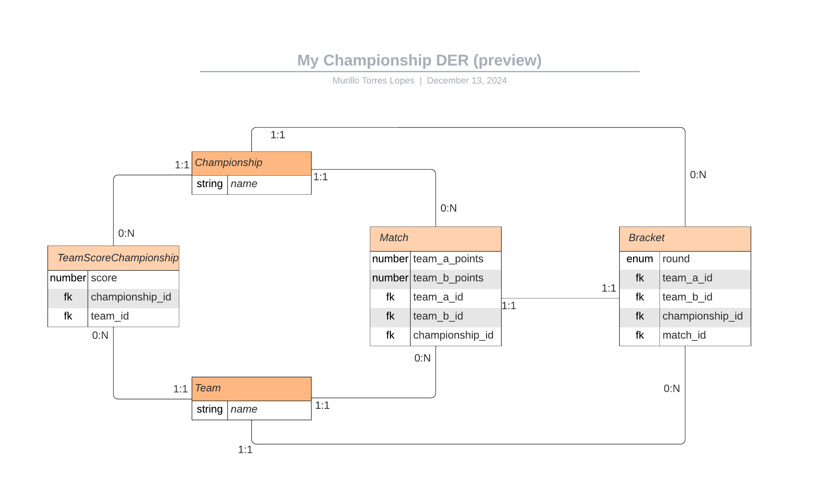
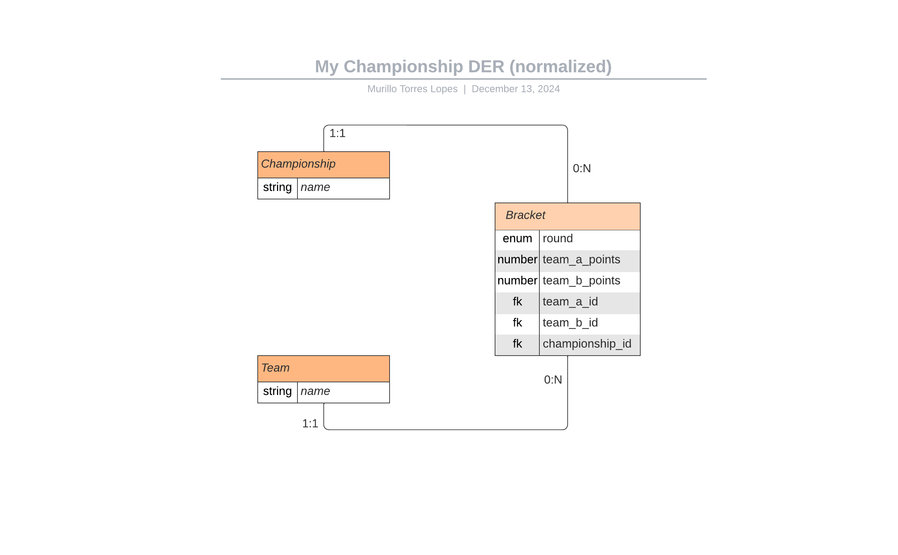

# Documentação do Projeto

  [Voltar para README](README.md)

## Requisitos da Aplicação

1. Node v^20.11
2. Docker para rodar o banco de dados ou
3. Banco de dados PostgreSQL

---

## Arquitetura da Aplicação

Foi implementada neste projeto a **Arquitetura Hexagonal** e **Arquitetura Limpa**, com devidas adaptações ao tamanho e necessidade do projeto. 

Embora pudesse ser utilizado o padrão de camadas (*layers*) — estruturado em rota, controlador, serviço e repositório —, optou-se por esta abordagem para demonstrar uma alternativa que:
- Permite maior **escalabilidade**,
- Garante **menor acoplamento** de dependências externas,
- Facilita a implementação de **testes**.

---

## Banco de Dados

Foram modelados dois **diagramas entidade-relacionamento**:

1. **Pré-visualização:**  
   Contém as entidades criadas apenas com o que foi solicitado pelo cliente.
   <!--  -->
   

2. **Normalizado:**  
   Aplicou-se a **normalização** de banco de dados na versão pré-visualização, eliminando entidades desnecessárias ou incorporando seus atributos em outras entidades.
   <!--  -->
   

---

## Executando a Aplicação

### Antes da Primeira Execução:

1. Instale as dependências:
   ```bash
   npm install
   ```
2. Configure e execute o banco de dados:
   ```bash
   docker compose up
   ```

---

## Scripts da Aplicação

- `npm run dev`: Executa a aplicação em modo de desenvolvimento.  
- `npm run test`: Executa todos os testes implementados.  
- `npm run test:unit`: Executa apenas testes unitários.  
- `npm run test:int`: Executa apenas testes de integração.  
- `npm run test:e2e`: Executa apenas testes de ponta a ponta.  
- `npm start`: Executa o código transpilado.

---

## Casos de Uso da Aplicação

### Campeonato
- Um usuário pode cadastrar um campeonato (**default**).
- Um usuário pode editar o nome de um campeonato (**extra**).
- Um usuário pode listar os campeonatos cadastrados (**extra**).
- Um usuário pode apagar um campeonato que não possuir chave de partida (**extra**).
- Um usuário pode solicitar a classificação final do campeonato (**default**).

### Times
- Um usuário pode cadastrar um time (**default**).
- Um usuário pode editar o nome de um time (**extra**).
- Um usuário pode listar os times cadastrados (**extra**).
- Um usuário pode apagar um time que não possuir vínculo em um campeonato (**extra**).

### Partidas
- Um usuário pode sortear as partidas do campeonato (**default**).

### Resultado das Fases da Competição
- Um usuário pode solicitar o resultado das quartas de final (**default**).
- Um usuário pode solicitar o resultado da semifinal (**default**).
- Um usuário pode solicitar o resultado do jogo que define o terceiro e quarto lugar (**default**).
- Um usuário pode solicitar o resultado do jogo final (**default**).

---

## Regras de Negócio

### Inscrição de Times
- Apenas **8 times** podem ser inscritos por campeonato.

### Chaveamento das Partidas
1. **Primeira Fase**: Quartas de Final  
   - São sorteados 4 jogos;  
   - Os vencedores disputam a semifinal.

2. **Segunda Fase**: Semifinal  
   - São sorteados 2 jogos;  
   - Os vencedores disputam a final;  
   - Os perdedores disputam o 3º e 4º lugar.

3. **Terceira Fase**: Final  
   - Disputada pelos vencedores da semifinal.

### Critérios de Desempate
1. Vence o time com **maior pontuação**:  
   - Para cada gol realizado, acumula-se **1 ponto**;  
   - Para cada gol sofrido, perde-se **1 ponto**.

2. Persistindo o empate:  
   - Vence o time que foi **primeiro inscrito** no campeonato.

### Resultados
1. Resultado das Partidas
   - Gerado randomicamente por script em **Python**.

2. Resultado do Campeonato
   - Deve ser possível recuperar o resultado de campeonatos realizados anteriormente.
